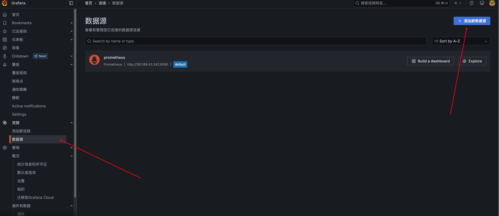
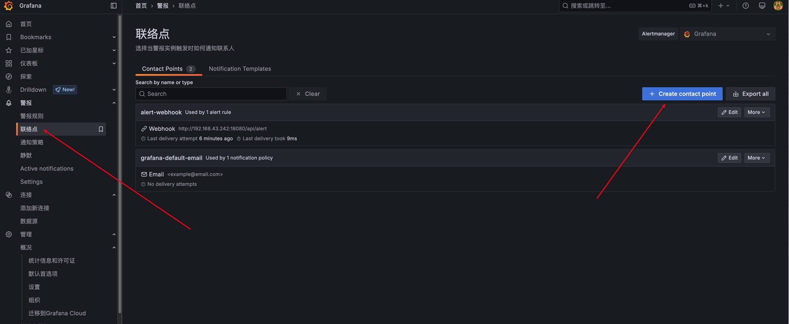
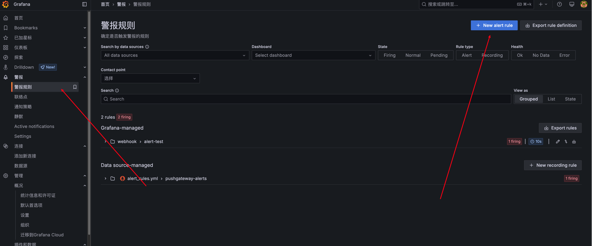

# grafana 安装教程

## 1. 下载

```bash

wget https://dl.grafana.com/oss/release/grafana-11.6.1.linux-amd64.tar.gz
```

## 2. 解压

```bash

tar-zxvf grafana-11.6.1.linux-amd64.tar.gz
```

## 3. 环境变量

```bash

# vim ~/.zshrc
export PATH=$PATH:/home/hello/local/grafana-v11.6.1/bin

# 刷新
source ~/.zshrc
```
 
## 4. 配置

[配置详解](./grafana-配置详解.md)

`conf/custom.ini`

```ini
[server]
protocol = http
http_addr = 192.168.43.242
http_port = 13000
```

## 5. 启动

```bash

./grafana-server
```

### Web页面

- 用户：admin
- 密码: admin

首次登录会让修改密码

```bash

http://192.168.43.242:13000
```

## 6. 添加数据源

连接 >> 数据源 >> 添加新的数据源

加入 `prometheus` 数据源



## 7. 添加仪表盘

仪表板 >> 新建


## 8. 新建联络点

添加 `webhook` 方式: `http://192.168.43.242:18080/api/alert` POST方法





## 9. 新建报警规则



## 10. `webhook示例`

`AlertController.java`

```java
@RestController
public class AlertController {

    @RequestMapping("/api/alert")
    public Map<String, String> alert(@RequestBody Map<Object, Object> body) {
        System.out.println(body);
        Map<String, String> result = new HashMap<>();
        result.put("code", "200");
        result.put("message", "success");

        
        return result;
    }
}

```

`application.yml`

```yml

server:
  port: 18080
spring:
  application:
    name: alert
```

### 输出

```json

{
  "receiver": "alert-webhook",
  "status": "firing",
  "alerts": [
    {
      "status": "firing",
      "labels": {
        "alertname": "alert-test",
        "app": "pushgateway",
        "exported_instance": "instance-1",
        "exported_job": "test-pushgateway",
        "grafana_folder": "webhook",
        "instance": "192.168.43.242:9091",
        "job": "pushgateway",
        "label1": "value1"
      },
      "annotations": {
        "description": "大于3000"
      },
      "startsAt": "2025-04-26T07:45:20Z",
      "endsAt": "0001-01-01T00:00:00Z",
      "generatorURL": "http://localhost:13000/alerting/grafana/dek21w782xp8gb/view?orgId=1",
      "fingerprint": "7cf686390c988a5b",
      "silenceURL": "http://localhost:13000/alerting/silence/new?alertmanager=grafana&matcher=__alert_rule_uid__%3Ddek21w782xp8gb&matcher=app%3Dpushgateway&matcher=exported_instance%3Dinstance-1&matcher=exported_job%3Dtest-pushgateway&matcher=instance%3D192.168.43.242%3A9091&matcher=job%3Dpushgateway&matcher=label1%3Dvalue1&orgId=1",
      "dashboardURL": "",
      "panelURL": "",
      "values": {
        "A": 4000,
        "C": 1
      },
      "valueString": [
        {
          "var": "A",
          "labels": {
            "__name__": "some_metric",
            "app": "pushgateway",
            "exported_instance": "instance-1",
            "exported_job": "test-pushgateway",
            "instance": "192.168.43.242:9091",
            "job": "pushgateway",
            "label1": "value1"
          },
          "value": 4000
        },
        {
          "var": "C",
          "labels": {
            "__name__": "some_metric",
            "app": "pushgateway",
            "exported_instance": "instance-1",
            "exported_job": "test-pushgateway",
            "instance": "192.168.43.242:9091",
            "job": "pushgateway",
            "label1": "value1"
          },
          "value": 1
        }
      ]
    }
  ],
  "groupLabels": {
    "alertname": "alert-test",
    "grafana_folder": "webhook"
  },
  "commonLabels": {
    "alertname": "alert-test",
    "app": "pushgateway",
    "exported_instance": "instance-1",
    "exported_job": "test-pushgateway",
    "grafana_folder": "webhook",
    "instance": "192.168.43.242:9091",
    "job": "pushgateway",
    "label1": "value1"
  },
  "commonAnnotations": {
    "description": "大于3000"
  },
  "externalURL": "http://localhost:13000/",
  "version": 1,
  "groupKey": "{}/{__grafana_autogenerated__=\"true\"}/{__grafana_receiver__=\"alert-webhook\"}:{alertname=\"alert-test\", grafana_folder=\"webhook\"}",
  "truncatedAlerts": 0,
  "orgId": 1,
  "title": "[FIRING:1] alert-test webhook (pushgateway instance-1 test-pushgateway 192.168.43.242:9091 pushgateway value1)",
  "state": "alerting",
  "message": "**Firing**\n\nValue: A=4000, C=1\nLabels:\n - alertname = alert-test\n - app = pushgateway\n - exported_instance = instance-1\n - exported_job = test-pushgateway\n - grafana_folder = webhook\n - instance = 192.168.43.242:9091\n - job = pushgateway\n - label1 = value1\nAnnotations:\n - description = 大于3000\nSource: http://localhost:13000/alerting/grafana/dek21w782xp8gb/view?orgId=1\nSilence: http://localhost:13000/alerting/silence/new?alertmanager=grafana&matcher=__alert_rule_uid__%3Ddek21w782xp8gb&matcher=app%3Dpushgateway&matcher=exported_instance=instance-1&matcher=exported_job=test-pushgateway&matcher=instance=192.168.43.242:9091&matcher=job=pushgateway&matcher=label1=value1&orgId=1"
}

```