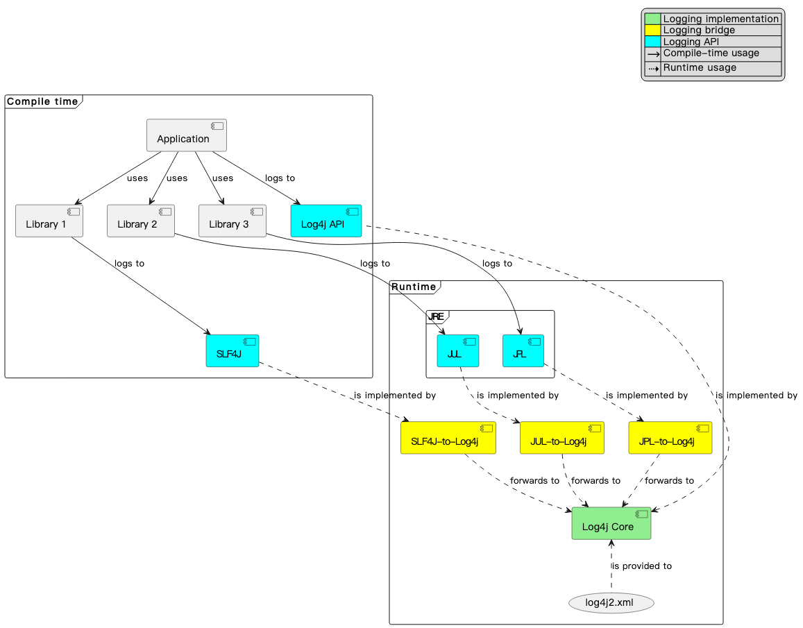

# 结构图


# log4j 配置

Log4j2 的 `log4j2.xml` 配置文件是用来定义日志的记录级别、输出方式（Appender）以及日志格式（PatternLayout）等内容的。以下是详细的讲解，包括示例代码和每个部分的解释。

---

## **1. 基本结构**
一个完整的 `log4j2.xml` 配置文件结构如下：
```xml
<?xml version="1.0" encoding="UTF-8"?>
<Configuration status="WARN">
    <Appenders>
        <!-- 1. 定义控制台日志输出 -->
        <Console name="Console" target="SYSTEM_OUT">
            <PatternLayout pattern="%d{yyyy-MM-dd HH:mm:ss} [%t] %-5level %logger{36} - %msg%n"/>
        </Console>

        <!-- 2. 定义文件日志输出 -->
        <File name="File" fileName="logs/app.log">
            <PatternLayout>
                <Pattern>%d{yyyy-MM-dd HH:mm:ss} [%t] %-5level %logger{36} - %msg%n</Pattern>
            </PatternLayout>
        </File>

        <!-- 3. 定义滚动日志文件 -->
        <RollingFile name="RollingFile" fileName="logs/app.log"
                     filePattern="logs/app-%d{yyyy-MM-dd}.log.gz">
            <PatternLayout>
                <Pattern>%d{yyyy-MM-dd HH:mm:ss} [%t] %-5level %logger{36} - %msg%n</Pattern>
            </PatternLayout>
            <Policies>
                <TimeBasedTriggeringPolicy interval="1" modulate="true"/>
                <SizeBasedTriggeringPolicy size="10MB"/>
            </Policies>
        </RollingFile>
    </Appenders>

    <Loggers>
        <!-- 4. 设置默认日志级别 -->
        <Root level="info">
            <AppenderRef ref="Console"/>
            <AppenderRef ref="RollingFile"/>
        </Root>

        <!-- 5. 针对某个特定包或类设置日志级别 -->
        <Logger name="com.example" level="debug" additivity="false">
            <AppenderRef ref="File"/>
        </Logger>
    </Loggers>
</Configuration>
```

---

## **2. 详细解释**
### **（1）Configuration**
```xml
<Configuration status="WARN">
```
- `status="WARN"`：设置 Log4j2 的自身日志级别，显示 Log4j2 内部的日志信息（DEBUG、INFO、WARN、ERROR）。
- `monitorInterval="30"`（可选）：每 30 秒自动检查 `log4j2.xml` 文件的变更，支持热更新。

---

### **（2）Appenders（日志输出方式）**
Appenders 定义日志的输出方式，例如 **控制台、文件、数据库、远程服务器等**。

#### **1️⃣ 控制台日志（Console）**
```xml
<Console name="Console" target="SYSTEM_OUT">
    <PatternLayout pattern="%d{yyyy-MM-dd HH:mm:ss} [%t] %-5level %logger{36} - %msg%n"/>
</Console>
```
- `target="SYSTEM_OUT"`：日志输出到 **标准输出**（`System.out`），可改为 `SYSTEM_ERR` 输出到 `System.err`。
- `PatternLayout`：定义日志格式：
  ```
  %d{yyyy-MM-dd HH:mm:ss}  # 日期时间
  [%t]                      # 线程名
  %-5level                  # 日志级别（左对齐，占5个字符）
  %logger{36}               # 打印 Logger 名称，最多显示 36 个字符
  - %msg%n                  # 日志消息
  ```

#### **2️⃣ 文件日志（File）**
```xml
<File name="File" fileName="logs/app.log">
    <PatternLayout>
        <Pattern>%d{yyyy-MM-dd HH:mm:ss} [%t] %-5level %logger{36} - %msg%n</Pattern>
    </PatternLayout>
</File>
```
- `fileName="logs/app.log"`：日志存储到 `logs/app.log` 文件。

#### **3️⃣ 滚动日志（RollingFile）**
```xml
<RollingFile name="RollingFile" fileName="logs/app.log"
             filePattern="logs/app-%d{yyyy-MM-dd}.log.gz">
    <PatternLayout>
        <Pattern>%d{yyyy-MM-dd HH:mm:ss} [%t] %-5level %logger{36} - %msg%n</Pattern>
    </PatternLayout>
    <Policies>
        <TimeBasedTriggeringPolicy interval="1" modulate="true"/>
        <SizeBasedTriggeringPolicy size="10MB"/>
    </Policies>
</RollingFile>
```
- `filePattern="logs/app-%d{yyyy-MM-dd}.log.gz"`：每天生成一个新日志文件，并自动压缩成 `.gz` 文件。
- `TimeBasedTriggeringPolicy`：每天创建一个新文件。
- `SizeBasedTriggeringPolicy size="10MB"`：日志文件超过 **10MB** 后也会生成新文件。

---

### **（3）Loggers（日志记录器）**
`Loggers` 用于定义不同的 **日志级别** 和 **Appender 绑定**。

#### **1️⃣ 根日志（Root Logger）**
```xml
<Root level="info">
    <AppenderRef ref="Console"/>
    <AppenderRef ref="RollingFile"/>
</Root>
```
- `level="info"`：默认 **INFO** 及以上级别（INFO、WARN、ERROR）都会被记录。
- 绑定 `Console` 和 `RollingFile`，意味着所有日志都会写入 **控制台** 和 **滚动文件**。

#### **2️⃣ 指定包或类的日志级别**
```xml
<Logger name="com.example" level="debug" additivity="false">
    <AppenderRef ref="File"/>
</Logger>
```
- `name="com.example"`：针对 **com.example** 这个包下的所有类单独设置日志级别。
- `level="debug"`：日志级别为 **DEBUG**（即 DEBUG、INFO、WARN、ERROR 都会被记录）。
- `additivity="false"`：
  - **`true`（默认）**：日志会 **继承 Root Logger 的 Appender**。
  - **`false`**：只会写入自己指定的 Appender。

---

## **3. 配置多个环境**
在生产环境和开发环境使用不同的日志级别，可以使用 **环境变量** 或 **多个配置文件**。

### **（1）使用环境变量**
在 `log4j2.xml` 中使用占位符：
```xml
<Configuration>
    <Properties>
        <Property name="log.level">${sys:LOG_LEVEL:-info}</Property>
    </Properties>
    
    <Loggers>
        <Root level="${log.level}">
            <AppenderRef ref="Console"/>
        </Root>
    </Loggers>
</Configuration>
```
- `sys:LOG_LEVEL` 读取 **系统环境变量 `LOG_LEVEL`** 作为日志级别。
- `:-info` 代表如果 `LOG_LEVEL` 没有设置，默认使用 `info`。

### **（2）使用多个配置文件**
创建：
- `log4j2-dev.xml`（开发环境）
- `log4j2-prod.xml`（生产环境）

然后在 **启动参数** 里指定：
```bash
-Dlog4j2.configurationFile=log4j2-dev.xml
```

---

## **4. 其他配置**
### **（1）异步日志**
如果日志量大，可以使用 **AsyncAppender** 提高性能：
```xml
<Async name="AsyncConsole">
    <AppenderRef ref="Console"/>
</Async>
```

### **（2）JSON 配置**
Log4j2 也支持 JSON 配置：
```json
{
  "Configuration": {
    "status": "WARN",
    "Appenders": {
      "Console": {
        "name": "Console",
        "PatternLayout": {
          "pattern": "%d{yyyy-MM-dd HH:mm:ss} [%t] %-5level %logger{36} - %msg%n"
        }
      }
    },
    "Loggers": {
      "Root": {
        "level": "info",
        "AppenderRef": [{ "ref": "Console" }]
      }
    }
  }
}
```

