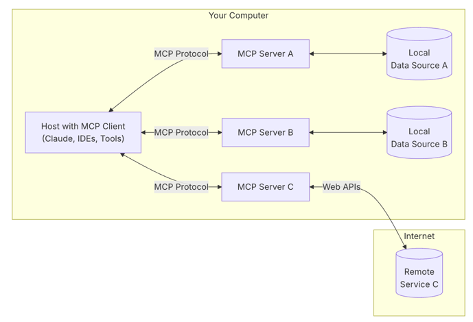

# MCP

[官方文档](https://modelcontextprotocol.io/introduction)

**Model Context Protocol (MCP)** 是由 Anthropic 提出并开源的一项开放标准，旨在为大型语言模型（LLM）提供一个通用且标准化的接口，使其能够无缝地与外部数据源、工具和服务进行交互。

简单来说，可以将 MCP 理解为 **AI 应用的 "USB-C 端口"**。就像 USB-C 统一了各种设备的连接方式一样，MCP 旨在统一 AI 模型与外部信息和功能的连接方式。

