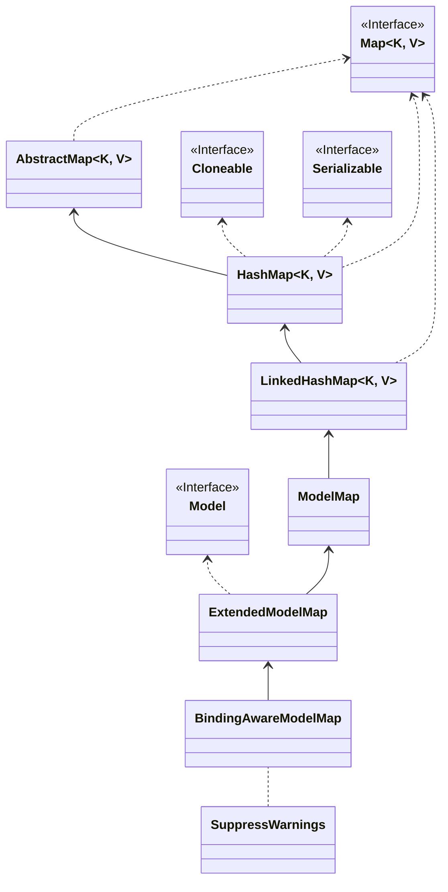

# SpringMVC-域对象


在 Spring MVC 中，**域对象**（Scope Objects）指的是在不同作用域（Scope）内存储数据的对象。Spring MVC 提供了多种作用域，每种作用域适用于不同的场景，例如：**请求级别、会话级别、应用级别**等。

---

## 1. 常见的 Spring MVC 域对象
Spring MVC 提供了以下常见的域对象（Scope Objects）：

| 域对象         | 作用范围            | 说明 |
|--------------|-----------------|-------------------------------------------------|
| `request`    | 单个 HTTP 请求     | 只在当前 HTTP 请求内有效，适用于一次性数据。 |
| `session`    | 单个用户会话       | 适用于存储需要跨多个请求的用户信息，如登录状态。 |
| `application` | 整个应用           | 适用于全局共享数据，存储在 `ServletContext`。 |
| `model`      | 当前请求的 Model    | 用于在 Controller 和 View 之间传递数据。 |
| `flash`      | 重定向时的临时数据   | 适用于 `redirect:` 之后仍需保留的数据。 |

---

## 2. Spring MVC 作用域（Scope）
Spring MVC 提供了 5 种作用域（Scope），决定了 Spring Bean 的生命周期：

| 作用域（Scope） | 说明 |
|----------------|-------------------------------------------------|
| `singleton`    | **默认**，全局唯一 Spring Bean，整个应用共享。 |
| `prototype`    | 每次请求 `getBean()` 时创建一个新的实例。 |
| `request`      | 仅在 **当前 HTTP 请求** 有效，请求结束后销毁。 |
| `session`      | 仅在 **当前用户会话** 有效，Session 结束后销毁。 |
| `application`  | 作用于 **整个 Web 应用**，随应用启动/销毁。 |


## 3.域对象共享数据

### 使用`HttpServletRequest` 向request域对象共享数据

```java
@RestController
@RequestMapping(value = "/api/scope")
public class ScopeController {

    // 使用HttpServletRequest 向request域对象共享数据
    @GetMapping("/request")
    public String testRequest(HttpServletRequest request) {
        request.setAttribute("hello", "world");
        System.out.println("ScopeController.testRequest run...");
        return "ScopeController.testRequest";
    }
    
}
```

### 使用`ModelAndView` 向request域对象共享数据

```java
@RestController
@RequestMapping(value = "/api/scope")
public class ScopeController {

    
    // 使用ModelAndView 向request域对象共享数据
    @GetMapping("/model-and-view")
    public ModelAndView testModelAndView() {
        ModelAndView mv = new ModelAndView("testModelAndView");
        mv.addObject("hello", "world");
        mv.setViewName("hello");
        System.out.println("ScopeController.testModelAndView run...");
        return mv;
    }
}
```

### 使用`Map` 向request域对象共享数据

- Model、ModelMap、Map类型的参数其实本质上都是 BindingAwareModelMap 类型的



```java

@RestController
@RequestMapping(value = "/api/scope")
public class ScopeController {
    

    // 使用Map 向request域对象共享数据
    @GetMapping("/map")
    public String testMap(Map<String, Object> map) {
        map.put("hello", "world");
        System.out.println("ScopeController.testMap run...");
        return "hello";
    }
    
}
```

### 使用`Model`向request域对象共享数据

```java
@RestController
@RequestMapping(value = "/api/scope")
public class ScopeController {


    // 使用Model 向request域对象共享数据
    @GetMapping("/model")
    public String testModel(Model model) {
        model.addAttribute("hello", "world");
        System.out.println("ScopeController.testModel run...");
        return "hello";
    }
    
}
```

### 使用`ModelMap`向request域对象共享数据

```java
@RestController
@RequestMapping(value = "/api/scope")
public class ScopeController {
    
    // 使用ModelMap 向request域对象共享数据
    @GetMapping("/model-map")
    public String testModelMap(ModelMap modelMap) {
        modelMap.addAttribute("hello", "world");
        System.out.println("ScopeController.testModelMap run...");
        return "hello";
    }

}
```

### 向session域共享数据

```java
@RestController
@RequestMapping(value = "/api/scope")
public class ScopeController {
    

    // 向Session域对象共享数据
    @GetMapping("/session")
    public String testSession(HttpSession session) {
        session.setAttribute("hello", "world");
        System.out.println("ScopeController.testSession run...");
        return "hello";
    }

}
```

### 向application域对象共享数据

```java
@RestController
@RequestMapping(value = "/api/scope")
public class ScopeController {
    
    // 向application域对象共享数据
    @GetMapping("/application")
    public String testApplication(HttpSession session) {
        ServletContext context = session.getServletContext();
        context.setAttribute("hello", "world");
        return "hello";
    }
}
```


