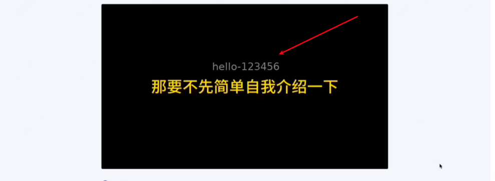

# 基于HLS流媒体防盗系统设计

## 1. 基本设计


### 1.1 demo.mov视频目录示例

#### 文件系统示例

```text
demo
├── base # 基础视频片段(无水印)
│   ├── demo0.ts
│   ├── demo10.ts
│   ├── demo11.ts
│   ├── demo12.ts
│   ├── demo13.ts
│   ├── demo14.ts
│   ├── demo15.ts
│   ├── demo16.ts
│   ├── demo17.ts
│   ├── demo18.ts
│   ├── demo19.ts
│   ├── demo1.ts
│   ├── demo20.ts
│   ├── demo21.ts
│   ├── demo22.ts
│   ├── demo23.ts
│   ├── demo24.ts
│   ├── demo25.ts
│   ├── demo26.ts
│   ├── demo27.ts
│   ├── demo28.ts
│   ├── demo29.ts
│   ├── demo2.ts
│   ├── demo30.ts
│   ├── demo3.ts
│   ├── demo4.ts
│   ├── demo5.ts
│   ├── demo6.ts
│   ├── demo7.ts
│   ├── demo8.ts
│   ├── demo9.ts
│   └── demo.m3u8
├── demo.mov
└── hello-123456
    ├── demo0.ts # 为用户hello-123456生成水印视频
    ├── demo3.ts # 为用户hello-123456生成水印视频
    └── hello-123456.m3u8
```

#### `hello-123456.m3u8` 示例

`demo0.ts`, `demo3.ts` 视频片段包含用户指纹，其余片段共享无指纹片段，节省资源

```text

#EXTM3U
#EXT-X-VERSION:6
#EXT-X-TARGETDURATION:10
#EXT-X-MEDIA-SEQUENCE:0
#EXT-X-INDEPENDENT-SEGMENTS
#EXTINF:10.000000,
demo0.ts
#EXTINF:10.000000,
../base/demo1.ts
#EXTINF:10.000000,
../base/demo2.ts
#EXTINF:10.000000,
demo3.ts
#EXTINF:10.000000,
../base/demo4.ts
#EXTINF:10.000000,
../base/demo5.ts
#EXTINF:10.000000,
../base/demo6.ts
#EXTINF:10.000000,
../base/demo7.ts
#EXTINF:10.000000,
../base/demo8.ts
#EXTINF:10.000000,
../base/demo9.ts
#EXTINF:10.000000,
../base/demo10.ts
#EXTINF:10.000000,
../base/demo11.ts
#EXTINF:10.000000,
../base/demo12.ts
#EXTINF:10.000000,
../base/demo13.ts
#EXTINF:10.000000,
../base/demo14.ts
#EXTINF:10.000000,
../base/demo15.ts
#EXTINF:10.000000,
../base/demo16.ts
#EXTINF:10.000000,
../base/demo17.ts
#EXTINF:10.000000,
../base/demo18.ts
#EXTINF:10.000000,
../base/demo19.ts
#EXTINF:10.000000,
../base/demo20.ts
#EXTINF:10.000000,
../base/demo21.ts
#EXTINF:10.000000,
../base/demo22.ts
#EXTINF:10.000000,
../base/demo23.ts
#EXTINF:10.000000,
../base/demo24.ts
#EXTINF:10.000000,
../base/demo25.ts
#EXTINF:10.000000,
../base/demo26.ts
#EXTINF:10.000000,
../base/demo27.ts
#EXTINF:10.000000,
../base/demo28.ts
#EXTINF:10.000000,
../base/demo29.ts
#EXTINF:2.100000,
../base/demo30.ts
#EXT-X-ENDLIST
```

### 1.1 视频发布流程

- 管理后台发布视频
- 转码：在保证视频质量的前提下，压缩视频体积，节省成本
- 切片：将视频切割为固定长度片段(10s)
- 加密: 使用 AES 对切片进行加密

### 1.2 防盗策略

- 用户指纹: 使用用户特征生成指纹, 示例 base64(version + hmac-sha-256(userId, key)); version表示密钥版本，用于轮换密钥。
- 视频可见水印: 用户可见，用于追踪泄漏源头
- 视频不可见水印: 此水印用户无法感知，用于追踪泄漏源头
- 音频水印: 此水印用户无法感知，用于追踪泄漏源头

## 2. 搭建示例(不加密数据)

### 2.1 nginx 搭建hls流媒体服务

```conf
server {
        listen       443 ssl;
        server_name  hls.hello.work;

        ssl_certificate      certs/hls.hello.work.fullchain.pem;
        ssl_certificate_key  certs/hls.hello.work.key.pem;

        #    ssl_session_cache    shared:SSL:1m;
        #    ssl_session_timeout  5m;
        ssl_protocols TLSv1.2 TLSv1.3;
        ssl_ciphers  HIGH:!aNULL:!MD5;
        ssl_prefer_server_ciphers  on;


        location /hls {
            types {
                application/vnd.apple.mpegurl m3u8;
                video/mp2t ts;
            }

            root /usr/share/nginx/html;  # 注意后面会放 m3u8 和 ts 文件
            add_header Cache-Control no-cache;
	        # 添加 CORS 头部
            add_header Access-Control-Allow-Origin *;
            add_header Access-Control-Allow-Methods "GET, POST, OPTIONS";
            add_header Access-Control-Allow-Headers "DNT,User-Agent,X-Requested-With,If-Modified-Since,Cache-Control,Content-Type,Range";
            add_header Access-Control-Expose-Headers "Content-Length,Content-Range";
        }
    }
```

### 2.2 生成基础视频片段

```bash

time ffmpeg -i demo.mov \
  -c:v libx264 \
  -preset veryfast \
  -x264-params "keyint=60:min-keyint=60:scenecut=0" \
  -c:a copy \
  -hls_time 10 \
  -hls_list_size 0 \
  -hls_flags independent_segments \
  -start_number 0 \
  -f hls \
  /home/hello/docker/nginx/html/hls/demo/base/demo.m3u8
```

### 2.3 为用户hello-123456生成水印视频

```bash

time ffmpeg -ss 0 -copyts -i base/demo0.ts \
  -vf "drawtext=text='hello-123456':fontcolor=white@0.5:fontsize=24:x=abs(mod(t*200\,1080-200)):y=abs(mod(t*100\,720-50))" \
  -map 0:v -map 0:a \
  -c:v libx264 -preset veryfast -x264-params "keyint=60:min-keyint=60:scenecut=0" \
  -c:a aac -b:a 128k \
  -pix_fmt yuv420p \
  -colorspace bt709 -color_primaries bt709 -color_trc bt709 \
  -copyts -muxpreload 0 -muxdelay 0 -avoid_negative_ts disabled \
  -y hello-123456/demo0.ts

```

### 2.4 前端示例

```html
<video id="video" controls autoplay></video>

<script src="https://cdn.jsdelivr.net/npm/hls.js@latest"></script>
<script>
  const video = document.getElementById('video');
  const videoSrc = 'https://hls.hello.work/hls/demo/hello-123456/hello-123456.m3u8';

  if (Hls.isSupported()) {
    const hls = new Hls();
    hls.loadSource(videoSrc);
    hls.attachMedia(video);
  } else if (video.canPlayType('application/vnd.apple.mpegurl')) {

    video.src = videoSrc;
  }
</script>

```

### 2.5 播放示例

[vlc工具](https://www.videolan.org/)




## 3. 加密示例(AES)


### 3.1 生成加密片段

```bash

# 生成密钥
openssl rand 16 > enc.key

# 生成enc.keyinfo
https://hls.hello.work/hls/demo-aes/enc.key # 密钥 URI，播放器会请求它
/home/hello/docker/nginx/html/hls/demo-aes/enc.key # 本地密钥文件路径
0123456789ABCDEF0123456789ABCDEF # 可选：IV（16字节十六进制），不写则 ffmpeg 自动生成


# 生成加密片段
time ffmpeg -i demo-aes.mov \
  -c:v libx264 \
  -preset veryfast \
  -x264-params "keyint=60:min-keyint=60:scenecut=0" \
  -c:a copy \
  -hls_time 10 \
  -hls_list_size 0 \
  -hls_flags independent_segments \
  -hls_key_info_file /home/hello/docker/nginx/html/hls/demo-aes/enc.keyinfo \
  -start_number 0 \
  -f hls \
  /home/hello/docker/nginx/html/hls/demo-aes/base/demo.m3u8

```


### 3.2 生成水印片段

```bash

# 十六进制 bba4d3caf0c67ada60a7f1fff02f7562
xxd -p enc.key

# 解密base/demo0.ts
openssl aes-128-cbc -d \
  -in base/demo0.ts \
  -out base/demo0-raw.ts \
  -nosalt \
  -K bba4d3caf0c67ada60a7f1fff02f7562 \
  -iv 0123456789ABCDEF0123456789ABCDEF

# 验证解密后的数据
ffprobe -hide_banner base/demo0-raw.ts

## 正常输出
Input #0, mpegts, from 'demo0-raw.ts':
  Duration: 00:00:10.00, start: 1.466667, bitrate: 978 kb/s
  Program 1
    Metadata:
      service_name    : Service01
      service_provider: FFmpeg
  Stream #0:0[0x100]: Video: h264 (High) ([27][0][0][0] / 0x001B), yuv420p(tv, bt709, progressive), 1920x1080, 30 fps, 30 tbr, 90k tbn, 60 tbc
  Stream #0:1[0x101]: Audio: aac (LC) ([15][0][0][0] / 0x000F), 44100 Hz, stereo, fltp, 106 kb/s


# 加水印
time ffmpeg -ss 0 -copyts -i base/demo0-raw.ts \
  -vf "drawtext=text='user-987654':fontcolor=white@0.5:fontsize=24:x=abs(mod(t*200\,1080-200)):y=abs(mod(t*100\,720-50))" \
  -map 0:v -map 0:a \
  -c:v libx264 -preset veryfast -x264-params "keyint=60:min-keyint=60:scenecut=0" \
  -c:a aac -b:a 128k \
  -pix_fmt yuv420p \
  -colorspace bt709 -color_primaries bt709 -color_trc bt709 \
  -copyts -muxpreload 0 -muxdelay 0 -avoid_negative_ts disabled \
  -y user-987654/demo0-raw.ts

# 加密
openssl aes-128-cbc -e \
  -in user-987654/demo0-raw.ts \
  -out user-987654/demo0.ts \
  -nosalt \
  -K bba4d3caf0c67ada60a7f1fff02f7562 \
  -iv 0123456789ABCDEF0123456789ABCDEF

```

### 3.3 前端示例

```bash

<video id="video" controls autoplay></video>

<script src="https://cdn.jsdelivr.net/npm/hls.js@latest"></script>
<script>
  const video = document.getElementById('video');
  const videoSrc = 'https://hls.hello.work/hls/demo-aes/user-987654/user-987654.m3u8';

  if (Hls.isSupported()) {
    const hls = new Hls();
    hls.loadSource(videoSrc);
    hls.attachMedia(video);
  } else if (video.canPlayType('application/vnd.apple.mpegurl')) {

    video.src = videoSrc;
  }
</script>

```

### 3.4 播放示例

[vlc工具](https://www.videolan.org/)


### 3.5 `demo-aes` 目录结构

#### 目录结构

```text
├── base
│   ├── demo0-raw.ts
│   ├── demo0.ts
│   ├── demo10.ts
│   ├── demo11.ts
│   ├── demo12.ts
│   ├── demo13.ts
│   ├── demo14.ts
│   ├── demo15.ts
│   ├── demo16.ts
│   ├── demo17.ts
│   ├── demo18.ts
│   ├── demo19.ts
│   ├── demo1.ts
│   ├── demo20.ts
│   ├── demo21.ts
│   ├── demo22.ts
│   ├── demo23.ts
│   ├── demo24.ts
│   ├── demo25.ts
│   ├── demo26.ts
│   ├── demo27.ts
│   ├── demo28.ts
│   ├── demo29.ts
│   ├── demo2.ts
│   ├── demo30.ts
│   ├── demo3.ts
│   ├── demo4.ts
│   ├── demo5.ts
│   ├── demo6.ts
│   ├── demo7.ts
│   ├── demo8.ts
│   ├── demo9.ts
│   └── demo.m3u8
├── demo-aes.mov
├── enc.key
├── enc.keyinfo
└── user-987654
    ├── demo0-raw.ts
    ├── demo0.ts
    └── user-987654.m3u8
```

#### `user-987654.m3u8` 示例

```text
#EXTM3U
#EXT-X-VERSION:6
#EXT-X-TARGETDURATION:10
#EXT-X-MEDIA-SEQUENCE:0
#EXT-X-INDEPENDENT-SEGMENTS
#EXT-X-KEY:METHOD=AES-128,URI="https://hls.hello.work/hls/demo-aes/enc.key",IV=0x0123456789ABCDEF0123456789ABCDEF
#EXTINF:10.000000,
demo0.ts
#EXTINF:10.000000,
../base/demo1.ts
#EXTINF:10.000000,
../base/demo2.ts
#EXTINF:10.000000,
../base/demo3.ts
#EXTINF:10.000000,
../base/demo4.ts
#EXTINF:10.000000,
../base/demo5.ts
#EXTINF:10.000000,
../base/demo6.ts
#EXTINF:10.000000,
../base/demo7.ts
#EXTINF:10.000000,
../base/demo8.ts
#EXTINF:10.000000,
../base/demo9.ts
#EXTINF:10.000000,
../base/demo10.ts
#EXTINF:10.000000,
../base/demo11.ts
#EXTINF:10.000000,
../base/demo12.ts
#EXTINF:10.000000,
../base/demo13.ts
#EXTINF:10.000000,
../base/demo14.ts
#EXTINF:10.000000,
../base/demo15.ts
#EXTINF:10.000000,
../base/demo16.ts
#EXTINF:10.000000,
../base/demo17.ts
#EXTINF:10.000000,
../base/demo18.ts
#EXTINF:10.000000,
../base/demo19.ts
#EXTINF:10.000000,
../base/demo20.ts
#EXTINF:10.000000,
../base/demo21.ts
#EXTINF:10.000000,
../base/demo22.ts
#EXTINF:10.000000,
../base/demo23.ts
#EXTINF:10.000000,
../base/demo24.ts
#EXTINF:10.000000,
../base/demo25.ts
#EXTINF:10.000000,
../base/demo26.ts
#EXTINF:10.000000,
../base/demo27.ts
#EXTINF:10.000000,
../base/demo28.ts
#EXTINF:10.000000,
../base/demo29.ts
#EXTINF:2.100000,
../base/demo30.ts
#EXT-X-ENDLIST
```

#### `enc.keyinfo` 示例

```text
https://hls.hello.work/hls/demo-aes/enc.key
/home/hello/docker/nginx/html/hls/demo-aes/enc.key
0123456789ABCDEF0123456789ABCDEF
```

## 4. 自定义auth接口


### 代码示例

#### `auth-demo.m3u8` 示例

使用自定义接口返回密钥

https://hls.hello.work/api/hls/auth

```text

#EXTM3U
#EXT-X-VERSION:6
#EXT-X-TARGETDURATION:10
#EXT-X-MEDIA-SEQUENCE:0
#EXT-X-INDEPENDENT-SEGMENTS
#EXT-X-KEY:METHOD=AES-128,URI="https://hls.hello.work/api/hls/auth",IV=0x0123456789ABCDEF0123456789ABCDEF
#EXTINF:10.000000,
demo0.ts
#EXTINF:10.000000,
../base/demo1.ts
#EXTINF:10.000000,
../base/demo2.ts
#EXTINF:10.000000,
../base/demo3.ts
#EXTINF:10.000000,
../base/demo4.ts
#EXTINF:10.000000,
../base/demo5.ts
#EXTINF:10.000000,
../base/demo6.ts
#EXTINF:10.000000,
../base/demo7.ts
#EXTINF:10.000000,
../base/demo8.ts
#EXTINF:10.000000,
../base/demo9.ts
#EXTINF:10.000000,
../base/demo10.ts
#EXTINF:10.000000,
../base/demo11.ts
#EXTINF:10.000000,
../base/demo12.ts
#EXTINF:10.000000,
../base/demo13.ts
#EXTINF:10.000000,
../base/demo14.ts
#EXTINF:10.000000,
../base/demo15.ts
#EXTINF:10.000000,
../base/demo16.ts
#EXTINF:10.000000,
../base/demo17.ts
#EXTINF:10.000000,
../base/demo18.ts
#EXTINF:10.000000,
../base/demo19.ts
#EXTINF:10.000000,
../base/demo20.ts
#EXTINF:10.000000,
../base/demo21.ts
#EXTINF:10.000000,
../base/demo22.ts
#EXTINF:10.000000,
../base/demo23.ts
#EXTINF:10.000000,
../base/demo24.ts
#EXTINF:10.000000,
../base/demo25.ts
#EXTINF:10.000000,
../base/demo26.ts
#EXTINF:10.000000,
../base/demo27.ts
#EXTINF:10.000000,
../base/demo28.ts
#EXTINF:10.000000,
../base/demo29.ts
#EXTINF:2.100000,
../base/demo30.ts
#EXT-X-ENDLIST

```

#### `AuthController.java`

```java

@RestController
public class AuthController {

    // 示例密钥，生产环境请从安全存储中获取
    private static final String AES_KEY_HEX = "bba4d3caf0c67ada60a7f1fff02f7562";

    @GetMapping(value = "/api/hls/auth", params = { "token" }, produces = MediaType.APPLICATION_OCTET_STREAM_VALUE)
    public ResponseEntity<byte[]> getEncryptionKey(
            @RequestHeader(value = "Authorization", required = false) String authHeader,
            @RequestParam("token") String token
    ) {

        System.out.println("authHeader: " + authHeader);
        System.out.println("token: " + token);
        // 可选：校验 Authorization token
        if (authHeader == null || !authHeader.equals("Bearer xxx")) {

//            return ResponseEntity.status(HttpStatus.UNAUTHORIZED).build();
        }

        // 将十六进制字符串转换为字节数组
        byte[] keyBytes = hexStringToByteArray(AES_KEY_HEX);
        return ResponseEntity.ok(keyBytes);
    }

    private byte[] hexStringToByteArray(String s) {
        int len = s.length();
        byte[] data = new byte[len / 2];
        for (int i = 0; i < len; i += 2) {
            data[i / 2] = (byte) ((Character.digit(s.charAt(i), 16) << 4)
                               + Character.digit(s.charAt(i+1), 16));
        }
        return data;
    }
}
```

#### 前端示例

```html

<video id="video" controls autoplay style="width: 100%; max-width: 100%;"></video>

<script src="https://cdn.jsdelivr.net/npm/hls.js@latest"></script>
<script>
  const video = document.getElementById('video');
  const token = 'token123456000000'; // 可以从 localStorage/cookie/后端获取
  const videoSrc = 'https://hls.hello.work/hls/demo-aes/auth-demo/auth-demo.m3u8';
  const authHeader = 'auth-666666000000'; // 自定义鉴权头部内容

  if (Hls.isSupported()) {
    const hls = new Hls({
      xhrSetup: function (xhr, url) {
        // 拦截 KEY 请求（.key URI）
        if (url.includes('/api/hls/auth')) {
          // 重写 URL 加上 token
          const newUrl = `${url}${url.includes('?') ? '&' : '?'}token=${encodeURIComponent(token)}`;
          xhr.open('GET', newUrl, true);
          xhr.setRequestHeader('Authorization', authHeader);
        }
      }
    });

    hls.loadSource(videoSrc);
    hls.attachMedia(video);

    hls.on(Hls.Events.ERROR, function (event, data) {
      console.error('HLS.js error:', data);
      if (data.fatal) {
        switch (data.type) {
          case Hls.ErrorTypes.NETWORK_ERROR:
            console.warn('Trying to recover from network error');
            hls.startLoad();
            break;
          case Hls.ErrorTypes.MEDIA_ERROR:
            console.warn('Trying to recover from media error');
            hls.recoverMediaError();
            break;
          default:
            console.error('Unrecoverable error, destroying HLS instance');
            hls.destroy();
            break;
        }
      }
    });
  } else if (video.canPlayType('application/vnd.apple.mpegurl')) {
    // Safari 原生支持 HLS
    video.src = videoSrc;
  } else {
    console.error('HLS not supported in this browser');
    alert('您的浏览器不支持 HLS 播放，请使用支持的浏览器（如 Chrome、Safari）');
  }
</script>

```

## 5. 不可见视频水印(未完待续)

## 6. 音频水印(未完待续)